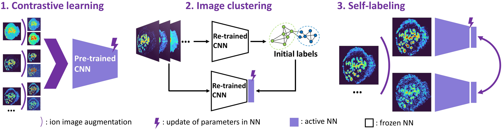
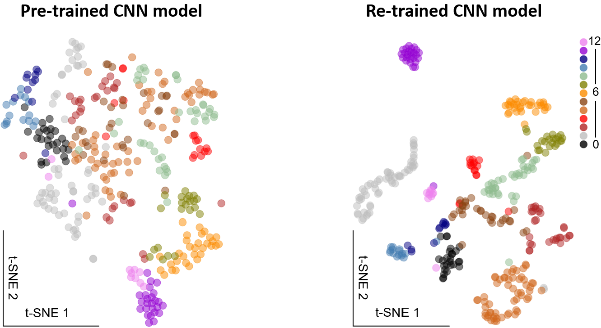

# MSI-self-supervised-clustering
It is a self-supervised clustering method that we developed to learn representations of molecular localization from mass spectrometry imaging (MSI) data without manual annotation. It enables efficient and autonomous clustering of co-localized molecules which is crucial for biochemical pathway analysis in molecular imaging experiments. This approach can facilitate the autonomous and high-throughput MSI-based scientific discovery. The self-supervised learning paradigm may be applied to other hyperspectral chemical imaging modalities. Development and evaluation of this method is described in detail in our recent preprint[1].

[1] Hu, Hang, Jyothsna Padmakumar Bindu, and Julia Laskin. "Self-supervised Clustering of Mass Spectrometry Imaging Data Using Contrastive Learning." Chemical Science, 2022, 13, 90. https://pubs.rsc.org/en/content/articlelanding/2022/SC/D1SC04077D

[2] Hu, Hang, Jyothsna Padmakumar Bindu, and Julia Laskin. "Self-supervised Clustering of Mass Spectrometry Imaging Data Using Contrastive Learning." ChemRxiv (2021). https://chemrxiv.org/engage/chemrxiv/article-details/610dc1ac45805dfc5a825394

# How it works
We approached the challenge of molecular localization clustering as an image classification task. We aimed to re-train a CNN model for an individual MSI dataset to classify ion images based on the high-level spatial features without manual annotations. The model architecture is shown below. The pre-trained CNN is re-trained by contrastive learning and self-labeling sequentially in a self-supervised manner. In current work, we use EfficientNet-B0 model before the classification layer as an encoder. In our architecture, we firstly learned ion image representations through the contrastive learning. More specifically, SimCLR approach is adopted in this study. After this first phase of training, we fed ion images through the re-trained encoder to produce a set of feature vectors, which were then passed to a spectral clustering (SC) classifier to generate the initial labels for the classification task. To initialize self-labeling, a linear classifier (a linear layer followed by a softmax function) was attached to the encoder and trained with the original ion images and initial labels as inputs. Finally, we utilized a self-labeling approach to fine-tune both the encoder and classifier, which allows the network to correct itself. Model training details, including ion image augmentation, confidently classified image selection and hyperparameter tuning are discussed in preprint. 

A manually classified mouse uterine MSI benchmark data is provided to evaluate the performance of the method. t-SNE visualizations of learned molecular localizations from benchmark data obtained by pre-trained and re-trained models are shown below. Full self-supervised clustering results of benchmark data is provided in the images. 

# What’s in this repository
Model training dependencies and helper functions are in ***code***, including `external`, `models`, `augmentations` and `utils`.  

Two trained models after each period of self-supervised training are provided in ***models***. 

The uterine MSI benchmark data is provided in ***benchmark_data***. 

`main.ipynb` is an example script for clustering benchmark data. It has been tested on Google Colab. 

# Tested environment
Google Colab (GPU & high-RAM) 
efficientnet_pytorch 0.7.0 

